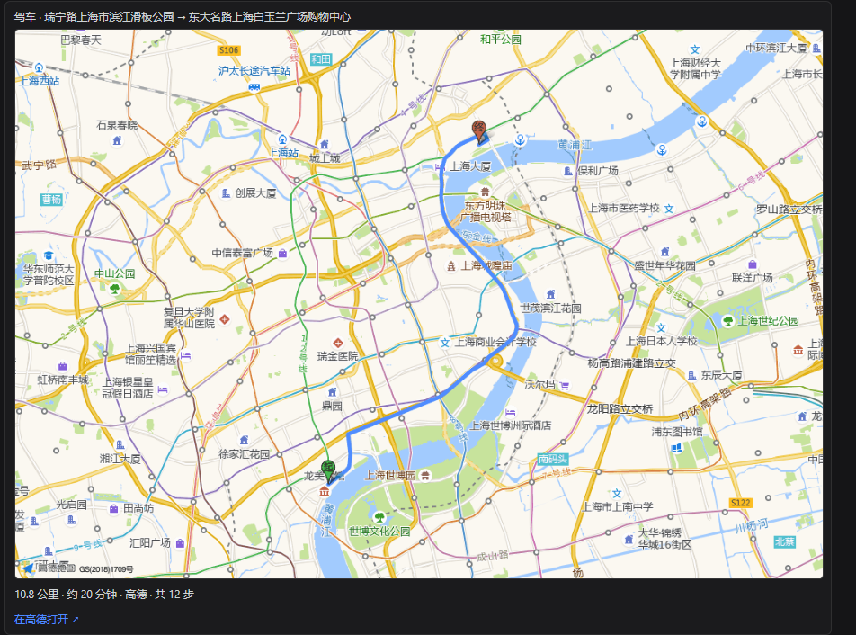

<p align="center">
  
</p>

# dsh-map-tools

<p align="center"><a href="README.md">中文</a> | English</p>

<p align="center"><strong>Native map &amp; routing tools</strong> for <a href="https://github.com/deepseek-ai/deepseek-harness">DeepSeek Harness</a>: driving / transit / walking / bicycling routes, geocoding, reverse geocoding and POI search. The model calls them directly — <strong>no MCP server</strong> — and every route it plans is drawn on a <strong>real map card</strong> below the final answer.</p>

<p align="center">
  <a href="https://www.npmjs.com/package/dsh-map-tools"></a>
  <a href="https://www.npmjs.com/package/dsh-map-tools"></a>
  <a href="LICENSE"></a>
  <a href="https://github.com/HorusJiang/dsh-map-tools/actions/workflows/ci.yml"></a>
  <a href="https://github.com/HorusJiang/dsh-map-tools/releases"></a>
  <a href="https://github.com/topics/dsh-plugin"></a>
  <a href="https://github.com/awesome-dsh-plugin/awesome-dsh-plugin"></a>
  = 20">
</p>

---

## Table of contents

- [What it is](#what-it-is)
- [What it looks like](#what-it-looks-like)
- [Install](#install)
- [Quick start](#quick-start)
- [Tool reference](#tool-reference)
- [Configuration](#configuration)
- [Data sources and degradation](#data-sources-and-degradation)
- [Known limitations](#known-limitations)
- [Architecture](#architecture)
- [FAQ](#faq)
- [Development](#development)
- [Publishing](#publishing)
- [Security](#security)
- [Contributing](#contributing)
- [License](#license)

## What it is

In one line: **turn "how do I get there" into 7 tools the model can call directly, and draw the result on a map you can actually see.**

- **7 native tools** (`map_*`): route planning (driving / transit / walking / bicycling), geocoding, reverse geocoding, POI search. Registered through DSH's `ctx.tools` — **not MCP**, no extra process.
- **Routes on a real map**: after the closing prose of a turn, a real map appears — Amap basemap + the route polyline drawn by Amap + origin/destination markers, with distance, duration, step count and an "Open in Amap" deep link. **Every route planned in the turn gets its own card** (labelled "k of N"), so the map can no longer show a different route than the prose.
- **Works with zero keys**: without a key, driving / walking / bicycling fall back to free OSM/OSRM; unreliable Chinese geocoding is reported with clear guidance. Add an Amap key to upgrade to the full capability set.
- **The key never leaves the host**: the static map is fetched by the **host** with the key; the browser only loads a local image. The key is never echoed to the page or the logs.
- **Card data costs no tokens**: route geometry and other card-only data never enter the model context.
- **Config page out of the box**: the sidebar **Plugins page → dsh-map-tools** — the bundle's detail page carries the configuration right there. Pick a data source, paste a key (masked), adjust the timeout; saving takes effect instantly, **no restart**. (Older hosts declare no such seat and the same card renders under `Settings → Plugins`.)
- **Model- and provider-agnostic**: the plugin only ships tools and cards; it never reads the model name, so behaviour is identical on any model/provider DSH supports.

## What it looks like

<p align="center">
  
</p>

<p align="center"><sub>Real screenshot: the route map card below the closing prose (driving, 10.8 km / ~20 min / 12 steps; the blue polyline is the real route drawn by Amap).</sub></p>

A route question produces three things:

| Where | What | Notes |
|---|---|---|
| Process area (the "thinking" block) | Compact summary + collapsible step list | **No map here** — the process area re-renders while the model thinks, so the map appears exactly once, at the final result (this also saves a static-map request) |
| Closing prose | Distance, duration, step-by-step directions, "Open in Amap ↗" | Model-visible text; this is what the model reasons over |
| **After** the closing prose (turn tail) | **Route map card**: real map + endpoints + distance/duration/steps + deep link | One card per route planned in the turn, labelled "k of N"; more than 3 routes shows the first 3 plus the total |

Four card states — none of them blank:

- **Running**: shows 「规划中…」 (planning).
- **Success with geometry**: the real map (Amap static map).
- **Success without a real map** (no key / quota exceeded / host route absent): **falls back to a self-drawn SVG sketch** — no external request, no frontend key, and the route shape, endpoints, distance and duration still show.
- **Failure**: the error text is displayed rather than swallowed.

> The turn tail is a **single-winner** seat in the DSH client: when the turn has routes, the map card takes that row and the official "files produced this turn" row does not render — the card notes "N other files produced this turn (the map card occupies this row; see the process area)".

## Install

### Option 1 — npm (recommended, prebuilt)

```sh
dsh plugin --profile web add dsh-map-tools
```

### Option 2 — from GitHub (source build)

```sh
dsh plugin --profile web add github:HorusJiang/dsh-map-tools
```

> The published package ships **no** `prepare` / `postinstall` build scripts, so pnpm ≥10 installs it without prompting to allow build scripts or configuring `allowBuilds`.

**Requirements**

- **DeepSeek Harness ≥ 0.1.2-rc.1** (peer deps: `@deepseek-ai/dsh-settings`, `@deepseek-ai/dsh-tools`, `@deepseek-ai/cordis` ^4.0.2). Earlier release lines are unsupported because `@deepseek-ai/dsh-settings` removed its legacy API.
- Verified end to end on **DSH 0.1.5-rc.1 + Node v24**; the compatible releases are recorded in `package.json` under `dsh.compatibility.dshReleases`.
- **Node ≥ 20**.
- The route map card and the config page need the **web profile** (`dsh.client.platform: web`). On TUI / headless the 7 tools still work — there are simply no graphical cards.

Restart `dsh web` after installing (press `R` in the launcher), then use the `map_*` tools in a session.

### Upgrade / uninstall / inspect

```sh
dsh plugin --profile web list                        # installed version
dsh plugin --profile web add dsh-map-tools@^0.7.0    # upgrade
dsh plugin --profile web remove dsh-map-tools        # uninstall
```

> **The 0.x caret trap**: on 0.x, a caret like `^0.6.1` only allows the same minor, so it **cannot** resolve 0.7.x. Name the target version when upgrading (e.g. `dsh-map-tools@^0.7.0`).

### Local development install

```sh
dsh plugin --profile web add /absolute/path/to/dsh-map-tools
```

This mounts the checkout via `link:`. Note that **source edits need `pnpm run build`**, and hot-replacing the plugin inside the host (no restart) additionally requires the hmr row and a junction — the full recipe is in [`docs/开发-热插拔-HMR.md`](docs/开发-热插拔-HMR.md).

## Quick start

Configure an Amap key (~2 minutes):

1. Open the [Amap console](https://console.amap.com/dev/key/app) → create an app → request a **"Web Service"** key (free for individuals).
2. On DSH's sidebar **Plugins page → dsh-map-tools**, paste the key, set the data source to `amap`, save (applies instantly).
3. Ask in a session:

```
Plan a driving route from Beijing South Station to Capital Airport T3
Geocode "西湖区文三路478号" to coordinates
Any gas stations within 1km of 116.397428,39.90923?
```

4. Expected result: the model answers with distance, duration and step-by-step directions, and a **map card appears below the closing prose**. Click "Open in Amap ↗" on the card to continue navigating in the Amap app or website.

## Tool reference

| Tool | What it does | Parameters | Free OSM | Amap |
|---|---|---|---|---|
| `map_driving_route` | Driving route planning | `origin`, `destination` (required; address or `"lng,lat"`); `waypoints` (`"lng,lat;lng,lat"`, **Amap only**); `alternatives` (default `false`) | ✅ | ✅ |
| `map_walking_route` | Walking route planning | `origin`, `destination` | ✅ | ✅ |
| `map_bicycling_route` | Bicycling route planning | `origin`, `destination` | ✅ | ✅ |
| `map_transit_route` | Transit (bus / metro) planning | `origin`, `destination` | — | ✅ |
| `map_geocode` | Address → coordinates | `address` | CJK unreliable | ✅ |
| `map_reverse_geocode` | Coordinates → structured address | `location` (`"lng,lat"`) | CJK unreliable | ✅ |
| `map_poi_search` | POI search | `keywords`; `location` (nearby-search centre), `radiusM` (default 1000, max 50000), `region` (city filter), `types` (POI type code, e.g. `060000` for dining) | — | ✅ |

Origins and destinations accept either **address text** or **`"lng,lat"` coordinates**; the plugin normalizes automatically.

**What the model sees**

- Distance, duration, step count, data source.
- Step-by-step directions: **all steps up to 24**; longer routes give the first 16 + "N steps omitted, M in total" + the **last 6** (the arrival segment is always present, so the model has no reason to re-compute a partial route).
- Coordinate inputs **echo the reverse-geocoded place name**, marked "(reverse geocoded)", so a wrong origin is visible at a glance: `endpoints: Beijing South Station → Beijing Capital International Airport (reverse geocoded)`.

**Card-only data never enters the model context**: route geometry (decimated to ≤ 200 points) and the endpoint names travel through `output.presentationMeta` into the session log, used solely to render the card — which is why the card costs no tokens.

## Configuration

### Bundle config page (recommended)

DSH's sidebar **Plugins page → dsh-map-tools** opens the bundle's detail page, and the configuration sits **between its description and its rows**: a status line (data source · key state), a data-source selector, the masked Amap key input (leave blank to keep the current one), the request timeout, plus a built-in "How to get an Amap key?" link and an "Open config file" action. Saving **rebuilds the tool instances**, so it takes effect immediately.

The section renders into the host's `plugins.bundle.config` seat (keyed by the package name `dsh-map-tools`): the host draws the page chrome — title, package name, description, switch, uninstall — and the plugin draws only the content. **Older hosts** (DSH ≤ 0.1.5 declare no such seat) fall back to `Settings → Plugins → dsh-map-tools` with exactly the same card.

Its behaviour matches the official configuration pages: edits are **staged and written only by Save** (what is on screen is what a save stores), **leaving the page discards them** (hence no Cancel control), an **invalid timeout blocks the save** instead of being silently rewritten, and after a save the form **re-seeds from what the host accepted**, which leaves the key input blank again.

### Config file

Config lives in **`~/.dsh-map-tools/config.json`** (mode 0600), decoupled from the DSH settings document and **shared across profiles**. The path can be overridden with the `DSH_MAP_TOOLS_CONFIG` environment variable.

```jsonc
// ~/.dsh-map-tools/config.json
{
  "provider": "amap",     // "amap" | "osm"
  "amapKey": "…",         // Amap "Web Service" key (secret, never echoed)
  "timeoutMs": 15000,
  "maxQps": 2,            // max Amap requests per second
  "defaultMode": "driving",
  "language": "zh"
}
```

| Key | Default | In config page | Notes |
|---|---|---|---|
| `provider` | `amap` | ✅ | `amap` = Amap (recommended, best China coverage); `osm` = free OSM fallback (no key, limited) |
| `amapKey` | — | ✅ | Amap **"Web Service"** key, [free to request](https://console.amap.com/dev/key/app) |
| `timeoutMs` | `15000` | ✅ | Per-request timeout (ms) |
| `maxQps` | `2` | edit JSON | Max Amap requests per second (2 sits below the usual limit of 3, avoiding `10021` quota errors) |
| `defaultMode` | `driving` | edit JSON | Default route mode (`driving` / `transit` / `walking` / `bicycling`) |
| `language` | `zh` | edit JSON | Response language (`zh` / `en`) |

> The key is surfaced to the frontend only as a boolean (`hasAmapKey`); the literal is **never echoed to the page or the logs**.

### cordis.yml defaults

Defaults can also be supplied in the profile's `cordis.yml`:

```yaml
- id: map-tools
  name: dsh-map-tools
  config:
    provider: amap
```

**Priority: config file (written by the config page) > `cordis.yml` defaults.**

### Loopback routes (advanced)

The config page talks to the plugin over same-origin loopback routes instead of writing DSH settings:

| Route | Purpose |
|---|---|
| `GET /dsh-map-tools/config` | Non-secret summary (`provider`, `hasAmapKey`, `timeoutMs`, …) |
| `GET /dsh-map-tools/config?open=true` | Open the config file in the editor |
| `POST /dsh-map-tools/config` | Apply a `provider` / `amapKey` / `timeoutMs` patch and rebuild the tools |
| `GET /dsh-map-tools/staticmap?w=&h=&line=` | Fetch a static map PNG (same-origin check, cached per parameter set, upstream request cancelled when the connection closes) |

The static map is fetched **by the host** and the browser only receives a local image — which is also why the image is not returned inside the tool result: it neither enters the model context nor has to be written into the attachment store.

## Data sources and degradation

| Source | Covers | Key | Notes |
|---|---|---|---|
| **Amap (高德)** | All 7 tools | [free to request](https://console.amap.com/dev/key/app) | Best China coverage: transit, POI, reliable Chinese geocoding |
| OSRM | driving / walking / bicycling | none | Free public instance, rate-limited |
| Photon / Nominatim | geocoding | none | Free public instances; **CJK parsing unreliable**, unreachable on some CN networks |

Degradation is always **stated**, never silent and never faked:

- **No key**: driving / walking / bicycling work (OSRM); transit and POI search return Chinese guidance saying a key is required, with the application link; unstable Chinese geocoding suggests passing `"lng,lat"` coordinates or configuring a key.
- **Key present but failing**: errors stay actionable (wrong key type, quota exceeded, unreachable network are all named).
- The free sources' CJK weakness is a **deliberate design choice**: instead of trying to "fix" it, the plugin points at a clear remedy.

## Known limitations

1. **The card mirrors only the current turn's route calls.** If the model computes only a detail-checking leg in this turn (the main route came from an earlier turn), the card shows that leg. The tool descriptions carry the contract: to reference an earlier turn's route, call the tool again in this turn with the same endpoints.
2. **At most 3 routes are drawn per turn**; beyond that the first 3 show plus the turn's total.
3. **The map card occupies the turn tail's single seat**: when the turn has routes, the official "files produced this turn" row does not render (the card reports the count). That is the chained slot's single-winner semantics, not a bug.
4. **Transit has no real polyline**: Amap v5 returns an empty transit polyline, so the card draws a schematic chain of walk segments and boarding/alighting stops.
5. **The map card and the config page are web-only**; TUI / headless get the tool text only.
6. The **"Open in Amap" deep link** uses the official `uri.amap.com` scheme and has not been verified case by case; please [open an issue](https://github.com/HorusJiang/dsh-map-tools/issues) if it misbehaves.
7. Rate limits and reachability of the free public sources are outside this plugin's control.

## Architecture

```
┌───────────────────────────────────────────────────────────────┐
│  Model (any model / provider DSH supports)                    │
│  map_driving_route / map_transit_route / ...  7 native tools  │
└─────────────────┬─────────────────────────────────────────────┘
                  │   ctx.tools (defineTool: validation + output.render)
┌─────────────────▼─────────────────────────────────────────────┐
│  Host half (TypeScript -> lib/)                               │
│    src/tools/            tool defs + model-visible text       │
│    src/clients/          provider clients                     │
│      amap.ts               Amap Web Service (recommended)     │
│      osrm.ts               OSRM free routing (fallback)       │
│      photon.ts / nominatim.ts  free geocoding (fallback)      │
│    src/geo.ts            geometry decode / decimate / encode  │
│    src/config-file.ts    ~/.dsh-map-tools/config.json 0600    │
│    src/config-route.ts   GET/POST /dsh-map-tools/config       │
│    src/staticmap-route.ts  GET /dsh-map-tools/staticmap       │
│    src/settings-ns.ts    settings namespace registration      │
└─────────────────┬─────────────────────────────────────────────┘
                  │   presentationMeta (never enters the model context)
┌─────────────────▼─────────────────────────────────────────────┐
│  Browser half  client/client.js (hand-written lazy-CJS)       │
│    - Bundle config (plugins.bundle.config, key = package)     │
│      older hosts fall back to Settings -> Plugins             │
│    - Turn-tail route card (conversation.chat.turnTail)        │
│      real map (host static image) -> self-drawn SVG sketch    │
└───────────────────────────────────────────────────────────────┘
```

- **Config priority**: config file (written by the config page) → `cordis.yml` defaults.
- **Instant apply**: tool instances rebuild on config change; no restart.
- **No MCP**: every capability is a native DSH tool; no external MCP server process.
- **Route geometry never enters the model context**: it exists only to draw the card, which is why the card costs no tokens.

## FAQ

**Q: I configured an Amap key but routes still use OSM.**
A: Check the config file's `provider` is `amap` (not `osm`) and `amapKey` is non-empty. The config card's status row shows the active source and key state.

**Q: Why do transit / POI search ask for a key?**
A: The free OSM sources provide neither transit nor POI data; those two need the Amap key.

**Q: My Amap key is rejected or errors out.**
A: Make sure it is a **"Web Service"** key (not JS API / Web), and that the services are enabled in the Amap console. `10021` means the QPS quota was hit — lower `maxQps` (default 2) or reduce request frequency.

**Q: Chinese geocoding reports "free source unavailable".**
A: Free sources (Photon / Nominatim) handle Chinese poorly and may be unreachable on some CN networks. By design — pass `"lng,lat"` coordinates, or configure an Amap key.

**Q: The route card shows no map.**
A: The card tries, in order: real map → self-drawn sketch → text row. No map usually means (1) no key, (2) Amap quota exceeded, or (3) not a web client. You still get a sketch or a text result — it is not a failure.

**Q: The card draws a different route than the prose.**
A: See [Known limitations](#known-limitations) #1 — the card mirrors **this turn's** route calls only. Ask the model to call the tool again with the same endpoints in the current turn; the tool descriptions already carry that contract.

**Q: Why is there no map in the process area (the "thinking" block)?**
A: By design. The process area re-renders as the model thinks; the map appears once at the turn tail (the final result) to avoid flicker and duplicate fetches.

**Q: The map card displaced the "files produced this turn" row.**
A: The turn tail is a single-winner seat. The card reports "N other files produced this turn"; the files themselves are in the process area.

**Q: Does the card cost tokens?**
A: No. Card data travels through `presentationMeta` and never enters the model context.

**Q: Do I need an MCP server?**
A: No. All 7 tools are native DSH tools.

**Q: Which DSH versions are supported?**
A: DSH ≥ 0.1.2-rc.1, verified on 0.1.5-rc.1. See [Install](#install).

## Development

```sh
pnpm install
pnpm run build                        # tsc → lib/
pnpm test                             # vitest unit tests (mocked network, 135 cases)
node scripts/smoke.mjs                # smoke: the host registers all 7 tools
node scripts/config-e2e.mjs           # config round-trip: the card's data path end to end
node scripts/integration.mjs          # real network: free sources (OSRM / Nominatim)
node scripts/amap-e2e.mjs             # real network: Amap (needs AMAP_API_KEY)
node scripts/call-driving-route.mjs   # single-call example
node scripts/check-secrets.mjs        # secret guard
pnpm hooks                            # install the pre-commit secret guard
```

Conventions worth knowing:

- Unit tests **always mock the network** (nothing under `tests/` makes real requests); scripts needing a real key read it from `process.env.AMAP_API_KEY` only — **never** write a key into any file.
- After editing `client/client.js`, run `node --check client/client.js`; the client tests load the very same shipped bytes.
- Any tool-facing change must come with unit tests.
- **Development hot-reload** (source edits without restarting or refreshing): recipe and upstream limits in [`docs/开发-热插拔-HMR.md`](docs/开发-热插拔-HMR.md).

Full conventions: [CONTRIBUTING.md](CONTRIBUTING.md) and [AGENTS.md](AGENTS.md).

## Publishing

Releases are run by CI ([`.github/workflows/release.yml`](.github/workflows/release.yml)), and they are **two steps — the second one is a human**:

```sh
# 1. The tag triggers it: CI runs the same gates CI runs, then `npm stage publish`
#    only stages the package (nothing is installable yet)
git tag -a vX.Y.Z -m "dsh-map-tools X.Y.Z" && git push origin vX.Y.Z

# 2. A maintainer approves with 2FA, then publishes the draft Release CI left behind
#    (all three commands are printed in the run summary)
npm stage list dsh-map-tools
npm stage approve <stage-id>
gh release edit vX.Y.Z --draft=false
```

Why two steps: the npm **trusted publisher is granted staged publishing only** (`npm publish` is not among its allowed actions), so a compromised workflow cannot put a package in front of the world on its own — the tag says "this is a release candidate", the 2FA prompt says "and this is a release". The one-time setup (add a GitHub Actions trusted publisher in the package's settings, leaving `npm publish` unchecked) is documented in the header of release.yml.

Without CI, or to publish by hand, the same moves are available locally:

```sh
node scripts/publish.mjs                  # direct: build → test → pack check → publish → verify installability
node scripts/publish.mjs --stage          # two-step: stage only, then approve with 2FA
node scripts/publish.mjs --verify-only    # verify one version is genuinely installable (sha1 compared)
```

Both paths judge "published" by one criterion: **fetch the tarball with a fresh cache and `--prefer-online`**, and compare its sha1 with the local build. npm's read path is several independently propagated caches (full packument, the corgi packument installs use, and the tarball) — **the website's `Published` badge and `npm view` both propagate earlier than the tarball and are not evidence of installability**.

Versioning follows [SemVer](https://semver.org/); changes are tracked in [CHANGELOG.md](CHANGELOG.md). The published package contains only `lib/`, `client/`, `cordis.patch.yml` and `LICENSE` (plus the `package.json` / READMEs npm always ships).

## Security

How the API key is stored (`~/.dsh-map-tools/config.json`, 0600, never echoed) and how to report a vulnerability: see [SECURITY.md](SECURITY.md).

## Contributing

Issues and PRs welcome! Please read [CONTRIBUTING.md](CONTRIBUTING.md) first for conventions and commit style.

## License

[MIT](LICENSE) © HorusJiang
